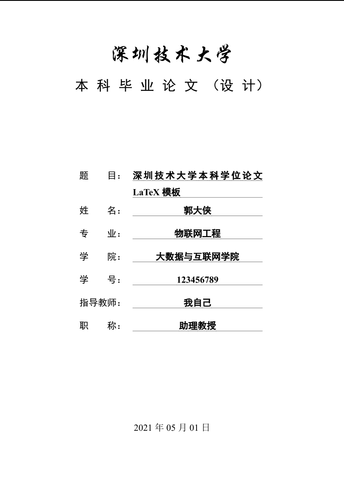

# 深圳技术大学学位论文Tex模版
## 欢迎Contribute，欢迎一起讨论学位论文 LaTeX 知识

欢迎对 LaTeX 感兴趣的同学参与项目维护，添加更多features

欢迎加入深圳技术大学学位论文 LaTeX 模板交流 QQ群： 710337475

## 项目起源

LaTeX利用设置好的模板，可以编译为格式统一的pdf。

目前国内大多出版社与高校仍在使用word，word由于其强大的功能与灵活性，在新手面对形式固定的论文时，排版、编号、参考文献等简单事务反而会带来很多困难与麻烦，对于一些需要通篇修改的问题，要想达到LaTeX的效率，对word使用者来说需要具有较高的技能水平。

为了能把主要精力放在论文撰写上，许多国际期刊和高校都支持LaTeX的撰写与提交，新手不需要关心格式问题，只需要按部就班的使用少数符号标签，即可得到符合要求的文档。且在需要全篇格式修改时，更换或修改模板文件，即可直接重新编译为新的样式文档，这对于word新手使用word的感受来说是不可思议的。

本项目的目的是为了创建一个符合深圳技术大学毕业论文（设计）撰写规范的TeX模板，解决学位论文撰写时格式调整的痛点。

本模板依照[2017级本科生毕业论文（设计）撰写规范及要求](./official_documents/2017级本科生毕业论文（设计）撰写规范及要求.pdf)编写。

## 主要内容



1. 封面；
2. 学位论文诚信声明；
3. 目录；
4. 中文摘要；
5. 论文正文；
6. 参考文献；
7. 致谢。
8. 英文摘要；
9. 附录（必要时）；

## 版本状况

完整支持本科生毕业论文要求。

## 文件介绍

### `SZTUthesis.cls`

样式文件，不需要管这个文件。

对LaTeX有所了解的同学，也可按需修改这个文件。如果这个文件的样式设计有什么bug，欢迎在issue里提出。

### `gbt7714-numerical.bst`和`gbt7714.sty`两个文件

来自项目[CTeX-org/gbt7714-bibtex-style](https://github.com/CTeX-org/gbt7714-bibtex-style)，是参考文献的样式。


### `content`目录

所有论文的编辑内容在这里。

`info.tex`：论文的各种信息，标题姓名学院之类的。

`abstactcn.tex`和`abstracten.tex`：顾名思义。

`content.tex`：从绪论到总结的全部正文内容。`\cite`的时候可能因为tex文件与主文件分离，LaTeX环境配置不到位，会有找不到bib的提示（Texlive+sublime会这样），没关系，照常插入需要的bibkey即可。

`additional.tex`：成果、致谢、附录之类的。


### `sztuthesis_main.tex`

论文主文件，正常情况下不用修改这个文件，以这个文件编译论文即可。

在content目录提供的页面不足以保证所需内容时，可以修改主文件，引入其他自定义content文件。

### `images`目录

放图片，模板已经配置了相对路径，所以在文中插图片时，直接用images目录下的相对路径即可，比如`images/sztu.png`，在正文中插入只需要`sztu.png`。

## 编译

### Linux

```bash
# 单次编译
make
# 持续集成
make pvc
```
或者
请使用`xelatex`，对`sztuthesis_main.tex`文件进行编译。
Windows下可以使用`TexMaker`,`TexStudio`等IDE，选中`xelatex`编译器进行编译。
使用高级文本编辑器，如sublime等，否则可能因为ANSI、UTF-8等编码格式问题编译失败。

### Windows

推荐使用 Visual Studio Code 编辑 Latex

## 1. 安装[texlive](http://tug.org/texlive/)

官网的用户体验很不好，找iso有点迷

这里有提供下载镜像的汇总：[https://ctan.org/mirrors](https://ctan.org/mirrors)

这个阿里云的镜像一时半会儿应该不会失效吧：[https://mirrors.aliyun.com/CTAN/systems/texlive/Images/](https://mirrors.aliyun.com/CTAN/systems/texlive/Images/)

下载 `texlive.iso`

打开iso文件，运行 `install-tl-windows.bat`，界面都看得懂，装就是了。

## 2. vscode 安装 latex workshop 扩展

vscode怎么装扩展不用赘述了

## 3. 设置里，找latex栏目下的 `Latex:Tools`，编辑`settings.json`

添加：

```json
{
    "name": "xelatex",
    "command": "xelatex",
    "args": [
        "-synctex=1",
        "-interaction=nonstopmode",
        "-file-line-error",
        "%DOC%"
    ]
},
```

## 4. `Latex:Recipes`，编辑`settings.json`

添加：

```json
{
    "name": "xelatex",
    "tools": [
        "xelatex"
    ]
},
{
    "name": "xelatex ➞ bibtex ➞ xelatex × 2",
    "tools": [
        "xelatex",
        "bibtex",
        "xelatex",
        "xelatex"
    ]
},
```

可以把latexmk的三条注释掉

要想使用bibtex参考文献，需要“四次编译”，可以设为默认，把`"xelatex ➞ bibtex ➞ xelatex × 2"`挪到前面。

## 一些快捷键

- ctrl+alt+b：编译
- ctrl+鼠标点击pdf：可跳至源码位置
- 在源码位置ctrl+alt+j可跳至pdf位置
- ctrl+k ctrl+a： 切换活动栏可见性(左侧图标开关)
- ctrl+alt+x：显示LaTeX面板(左侧编译命令面板和文档大纲)。
- ctrl+alt+c：清除辅助文件
- ctrl+alt+v：查看编译的pdf文件(预览)
- ctrl+alt+j：正向搜索。当设置`"latex-workshop.view.pdf.viewer": "tab";`时，在LaTeX源文件中按下快捷键，定位到PDF文档相应位置。
